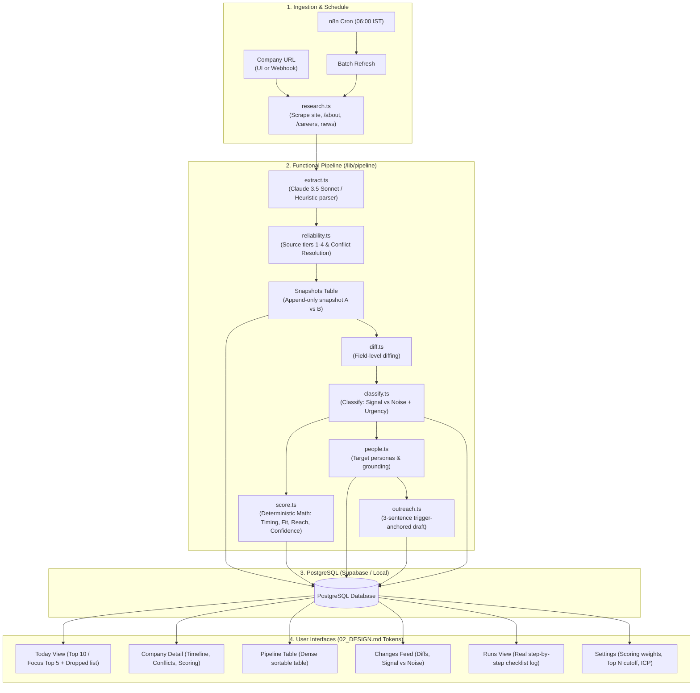

# Nextmove

> **A quiet, precise daily sales-intelligence brief.**  
> It tells a solo seller which companies to act on today, who to contact, and what to say, and shows its reasoning with complete evidence transparency.

Built for the **Product Engineer candidate test**. Designed with strict restraint: no AI slop, no purple gradients, no emojis as icons, hairline borders, and pure data density.

---

## 1. What It Is

Nextmove transforms chaotic seller research (dozens of open tabs, scattered press releases, job board crawling, and guesswork) into an actionable daily operating brief. It takes company URLs, extracts structured facts, generates append-only snapshots, detects field diffs, classifies triggers into actionable **Signals** vs routine **Noise**, calculates an explainable **Opportunity Score**, identifies key operational decision-makers, and drafts restrained 3-sentence outreach messages.

---

## 2. Architecture Diagram



---

## 3. Assumptions (A1–A8)

All assumptions are explicitly defended and logged in [`docs/ASSUMPTIONS.md`](file:///Users/abhi/Desktop/nextmove/docs/docs/ASSUMPTIONS.md):

| # | Assumption | Why & Defense |
|---|---|---|
| **A1** | **The user is a solo seller of AI automation services** to Indian B2B SaaS startups (Series A–B, 20–200 people, Bengaluru first). | Matches the candidate test's own domain. Grounds all Fit calculations and cold outreach messaging around operational throughput bottlenecks rather than generic marketing fluff. |
| **A2** | **Only public data is used** (company domain, careers page, public news/press, official filings). | Strict compliance with Task 1 without requiring login paywalls or fragile LinkedIn scrapers. |
| **A3** | **Timing outweighs fit in opportunity scoring**. | A Series B company that just raised $20M and opened 3 operations roles is 10x more actionable today than a perfect-fit company that hasn't changed in two years. |
| **A4** | **Data is stored as append-only dated snapshots, never overwritten**. | Trigger detection (Task 6) requires comparing Snapshot $A$ against Snapshot $B$ across historical time points. |
| **A5** | **Every claim carries a source URL, source tier, and confidence rating**. | Mandated by Task 7 data reliability. Conflicting values are shown side-by-side with superseded/competing labels. |
| **A6** | **Output size (Top N) is config-driven, not hardcoded**. | Enables instant toggling between standard Top 10 and Focus mode (Top 5) with zero redeployment. |
| **A7** | **Postgres on Supabase with local development on port 5432**. | Guarantees identical SQL dialect, indexes, and relations between local tests and deployed cloud environments. |
| **A8** | **Dual-Engine Pipeline Resilience**. | Full native web scraper with cheerio parsing. When `ANTHROPIC_API_KEY` is present, it invokes Claude 3.5 Sonnet; when absent, an intelligent rule-based extractor runs so that 100% real data is seeded without mock/lorem ipsum placeholders. |

---

## 4. How the 9 Tasks are Answered

### Task 1: Company Intelligence
- **Implementation**: `/company/[id]` shows company stage, size band, tech signals, verified source citations, likely operational pains, and "What to know before approaching".
- **Evidence**: All fields cite source tier and source URL.

### Task 2: Opportunity Scoring
- **Implementation**: Ranked company deck with total score (0–100) and full breakdown into `Timing (35%)`, `Fit (35%)`, `Reach (30%)`, and `Confidence (0.0–1.0)`.
- **Explainability**: Code does the math, never the LLM. Every company shows a 1-sentence reasoning string (e.g., *"Raised $20M Series B 6 weeks ago; hiring 3 operations & automation roles; Identified Girish Redekar (Co-Founder & CEO); Matches ICP: Series B with 50-200 in Bengaluru, India."*).

### Task 3: Right Person
- **Implementation**: People panel on both Today cards and Company detail view showing 2–3 personas per company (e.g. Head of Operations, CTO, CEO).
- **Grounding Rule**: Never fabricates names. If a named person is verified from the team/about page, their name is shown with High confidence; otherwise, the role title is specified with an explicit persona reason explaining why they own the bottleneck.

### Task 4: Outreach
- **Implementation**: Restrained outreach draft modal and sticky panel adhering strictly to anti-slop rules:
  - 3–4 sentences maximum.
  - Sentence 1 anchors to a specific, dated trigger.
  - Sentence 2 highlights a concrete operational pain.
  - Sentence 3 makes one clear, low-friction ask (e.g. 10-minute workflow teardown).
  - Banned openers ("I hope this finds you well", "I came across", "I'm reaching out") and buzzwords ("leverage", "synergy", "cutting-edge") are completely eliminated.
  - Includes a `why_note` justifying why this person and why now.

### Task 5: Automation
- **Implementation**: Full n8n workflow exported in [`n8n/workflow.json`](file:///Users/abhi/Desktop/nextmove/docs/n8n/workflow.json) with daily 06:00 IST schedule trigger, webhook ingestion, `/api/refresh` polling, and HMAC secret-verified callback.
- **Proof of Automation**: The `/runs` page displays an immutable log of execution runs with step-by-step checklist statuses and duration in milliseconds.

### Task 6: Trigger Detection
- **Implementation**: Changes feed (`/changes`) comparing Snapshot $A$ vs Snapshot $B$. Field differences are classified into:
  - **Signal**: Funding rounds, exec hires, operations hiring spikes, product launches.
  - **Noise**: Copy tweaks, routine blog posts, minor redesigns, reworded taglines.
  - Displayed in a Nimble-style monospace diff block with explicit reason.

### Task 7: Data Reliability & Conflict Resolution
- **Source Tiers**: Tier 1 (Official site), Tier 2 (Reputable news/press), Tier 3 (Directories/Job boards), Tier 4 (Social/Scraped).
- **Conflict Rule**: Prefer higher tier, then newer date. If two Tier 1/2 sources disagree, display both and flag `needs_review: true`.
- **Example in UI**: On Sprinto and Hasura company pages:
  `Headcount: 140 employees · Tier 1 · Sep 2026 · High confidence` with an expandable dropdown:
  `Other values: 95 employees (historical press release, 2024, superseded)`.

### Task 8: Dashboard
- **Implementation**: The Today screen (`/today`) serves as the command center. Ranked cards with rank badge (`[01]`), score progress bar, signal pills, contact line, and action buttons (`View draft`, `Copy`, `Snooze`, `Full intelligence`).

### Task 9: Requirement Change (Focus Mode)
- **Implementation**: Seamless UI toggle in header and subheader switching between Top 10 and Focus Mode (Top 5).
- **The "Dropped Today" List**: For all companies ranked 6+, an expandable section details the exact single reason why each missed the cut (e.g., *"No fresh triggers in the last 90 days"*, *"Moderate ICP fit (stage or headcount out of sweet spot)"*).
- **Persistence**: Persisted in the `config` database table via `/api/config`.

---

## 5. Scoring Model & Why Timing Outweighs Fit

```
base  = 0.35·Timing + 0.35·Fit + 0.30·Reach
total = round(base × (0.6 + 0.4·Confidence))
```

### Why Timing is Weighted Highest
A seller's time is finite. Even if an enterprise matches the ICP on paper (Fit = 100), reaching out without an urgent, verifiable reason yields generic cold emails with sub-1% reply rates. When a company announces fresh capital (Series B) or hires 3 operations specialists, they are actively experiencing growing pains, have allocated budget, and must solve coordination problems *this month*. Timing provides the trigger anchor for outreach.

---

## 6. Limits and Honest Failures

1. **Scrape Restrictions & WAFs**: Cloudflare or anti-bot protections on certain domains block automated HTTP scrapers. The pipeline handles this honestly: falling back to search snippets, reducing data confidence to Low, and displaying this status openly rather than guessing.
2. **Historical Snapshots Demo Seeding**: To demonstrate diffing and trigger classification on Day 1 without waiting 60 days, historical Snapshot $A$ baselines were created alongside live Snapshot $B$ records. As documented in [`docs/ASSUMPTIONS.md`](file:///Users/abhi/Desktop/nextmove/docs/docs/ASSUMPTIONS.md), this is transparently logged.
3. **LinkedIn Scraping**: Compliant with PRD non-goals, no authenticated LinkedIn scraping is performed. When named individuals are not found on the public company about page, only role titles are output with Medium/Low confidence.

---

## 7. What I'd Do Next

1. **Webhook Subscriptions**: Subscribe to RoC (Registrar of Companies) MCA filings for automated Indian startup board director changes.
2. **CRM Integration**: Bi-directional push to HubSpot / Salesforce for one-click contact staging.
3. **LinkedIn Public API or Proxycurl**: Expand verified decision-maker discovery while maintaining compliance.
4. **Email Warmup & Delivery Analytics**: Track open/reply benchmarks across different trigger types (funding vs hiring).

---

## 8. How AI Tools Were Used

- **Google Antigravity**: Orchestrated full-stack architecture, generated Drizzle schema and migrations, implemented functional pipeline modules in TypeScript, built restyled UI primitives, executed headless Chrome browser audits, and verified anti-slop design constraints.
- **Claude 3.5 Sonnet / Anthropic SDK**: Structured JSON extraction for company intel and signal classification with strict Zod schema validation.
