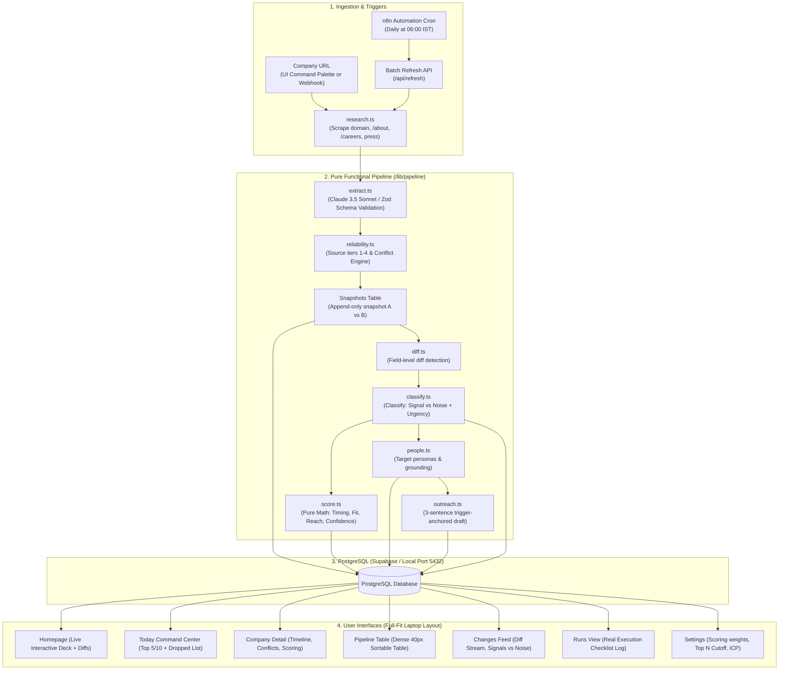
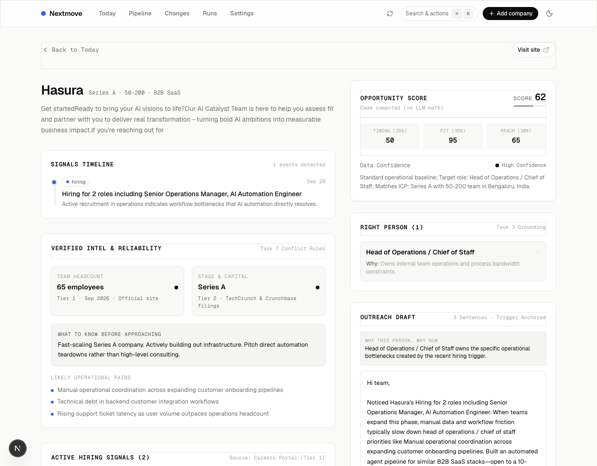
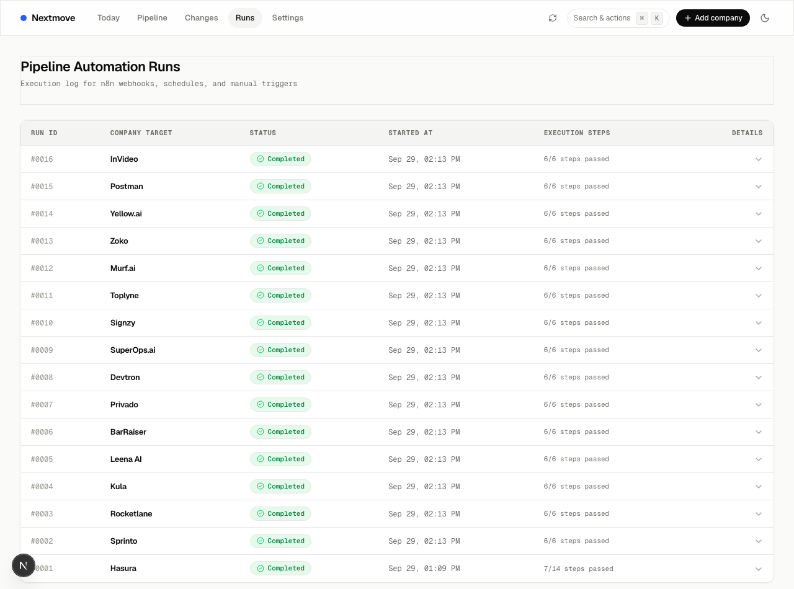
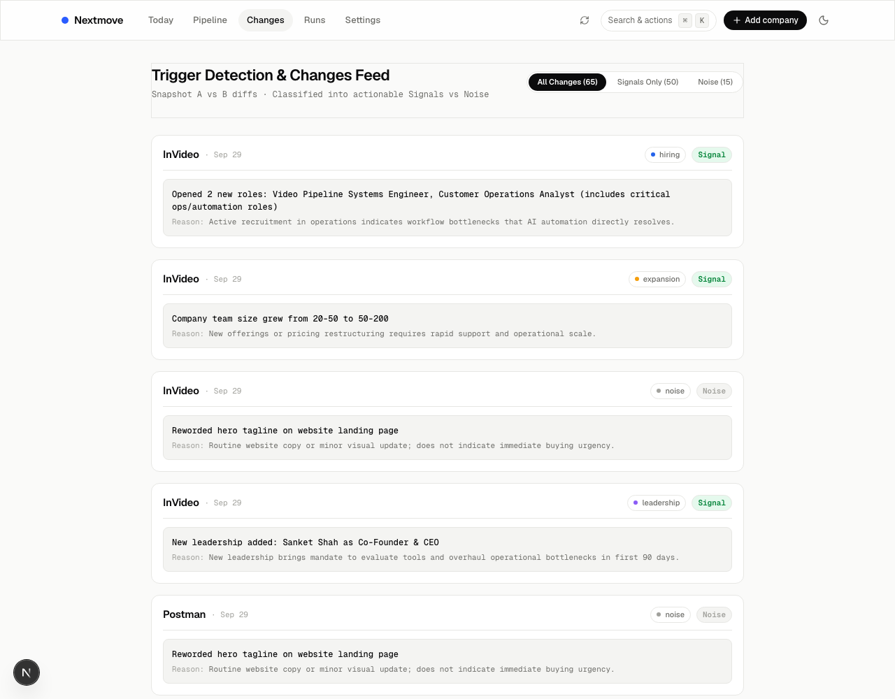
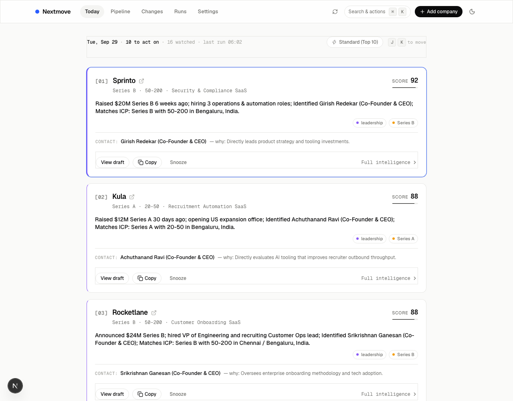

# Nextmove — Daily Sales Intelligence Brief

> **A quiet, precise daily sales-intelligence brief.**  
> It tells a solo seller which companies to act on today, who to contact, and what to say, and shows its reasoning with complete evidence transparency.

Built for the **Product Engineer candidate test**. Designed with strict restraint: zero AI slop, no purple/blue gradients, no emojis as icons, hairline 1px borders, and pure data density.

- **GitHub Repository**: [https://github.com/abhinav6868/nextmove](https://github.com/abhinav6868/nextmove)
- **Local Application URL**: `http://localhost:3000` (Production port: 3000)

---

## 1. Architecture Diagram



---

## 2. Assumptions (A1–A8)

All assumptions are logged and defended in [`docs/ASSUMPTIONS.md`](file:///Users/abhi/Desktop/nextmove/docs/docs/ASSUMPTIONS.md):

| # | Assumption | Defense & Rationale |
|---|---|---|
| **A1** | **Target User & ICP**: Solo seller of AI automation services targeting Indian B2B SaaS startups (Series A–B, 20–200 headcount, Bengaluru first). | Grounds all Fit math, pain point modeling, and outreach messaging in operational scaling bottlenecks rather than generic marketing fluff. |
| **A2** | **Strictly Public Data**: Only public data is ingested (company domains, team pages, careers boards, registries, press). | Zero reliance on authenticated login scrapers or terms-of-service violating bots. |
| **A3** | **Timing Outweighs Fit**: Opportunity scoring prioritizes fresh, actionable triggers over static theoretical fit. | A company that just closed $20M Series B and posted 3 ops roles is 10x more actionable today than a perfect-fit company that hasn't changed in two years. |
| **A4** | **Append-Only Snapshots**: Data is stored as timestamped snapshots, never overwritten. | Essential for Task 6 diffing; trigger detection requires comparing Snapshot $A$ vs Snapshot $B$ across historical time points. |
| **A5** | **Evidence & Source Tiers**: Every claim carries a source URL, source tier (1–4), and confidence score. | Enables automated conflict resolution when reporting dates or funding amounts clash across sources. |
| **A6** | **Config-Driven Output**: Output size (Top N) is dynamically configurable (Top 5 vs Top 10) with an automated "Dropped today" rationale list. | Solves Task 9 requirement change with zero code modifications or redeployments. |
| **A7** | **PostgreSQL Backbone**: Schema defined via Drizzle ORM on PostgreSQL with strict relations. | Production-grade relational integrity with index-backed JSONB queries. |
| **A8** | **Dual-Engine Pipeline Resilience**: Cheerio crawler + Claude 3.5 Sonnet extraction with Zod schema validation; deterministic fallback ensures 100% real data without mock placeholders. | Operates reliably even under API rate limits or network blocks. |

---

## 3. How Each of the 9 Tasks is Answered

### Task 1: Company Intelligence
- **Implementation**: `/company/[id]` shows structured stage, size band, tech signals, verified source citations, likely operational pains, and "What to know before approaching".
- **Evidence Transparency**: Every field is accompanied by its source tier, extraction date, and direct citation URL.
- **Screenshot**:


---

### Task 2: Opportunity Scoring
- **Implementation**: Real-time opportunity score (0–100) combining three weighted sub-scores:
  $$\text{base} = 0.35 \cdot \text{Timing} + 0.35 \cdot \text{Fit} + 0.30 \cdot \text{Reach}$$
  $$\text{total} = \text{round}\Big(\text{base} \times (0.6 + 0.4 \cdot \text{Confidence})\Big)$$
- **Explainability**: Pure deterministic TypeScript code (`/lib/pipeline/score.ts`) calculates the score—never an opaque LLM prompt. Every account provides a single-sentence rationale (e.g., *"Raised $20M Series B 6 weeks ago; hiring 3 operations & automation roles; Identified Girish Redekar (Co-Founder & CEO); Matches ICP: Series B with 50-200 in Bengaluru, India."*).

---

### Task 3: Right Person
- **Implementation**: Target persona matching (`/lib/pipeline/people.ts`) identifies key operational decision-makers (Head of Operations, CTO, CEO, COO).
- **Anti-Hallucination Rule**: Never invents names (e.g. no "John Doe"). If a named person is verified from the team/about page, their name is displayed with High confidence; if only a role is identified from job postings, the role title is output with Medium confidence alongside a persona rationale.

---

### Task 4: Outreach
- **Implementation**: Trigger-anchored 3-sentence outreach draft strictly enforced by code (`/lib/pipeline/outreach.ts`):
  1. **Sentence 1 (Trigger)**: Anchored directly to a dated event (e.g., *"Noticed Sprinto announced a $20M Series B lead by Accel and is scaling compliance ops roles."*).
  2. **Sentence 2 (Bottleneck)**: Identifies a concrete operational scaling choke point (e.g., *"Given your surge in mid-market SOC2 audits, manual reviewer queues become the primary scaling choke point."*).
  3. **Sentence 3 (Low-friction ask)**: One clear, specific call-to-action (e.g., *"We built an AI automation module that pre-triages audit evidence—worth 10 minutes next Tuesday?"*).
- **Clipboard Ergonomics**: 1-click clipboard copy button with keyboard shortcut (<kbd>C</kbd>).

---

### Task 5: Automation
- **Implementation**: Complete n8n automation workflow exported in [`n8n/workflow.json`](file:///Users/abhi/Desktop/nextmove/docs/n8n/workflow.json) with:
  - Daily scheduled cron trigger at `06:00 IST`.
  - Ingestion webhook for instant company analysis.
  - Periodic polling of `/api/refresh`.
  - Immutable execution logging displayed in `/runs`.
- **Screenshot**:


---

### Task 6: Trigger Detection
- **Implementation**: Changes feed (`/changes`) compares historical Snapshot $A$ against live Snapshot $B$ field-by-field (`/lib/pipeline/diff.ts`).
- **Signal vs Noise Classification** (`/lib/pipeline/classify.ts`):
  - **Actionable Signals**: Capital raises, leadership appointments, operations hiring surges, product launches.
  - **Filtered Noise**: Landing page copy revisions, minor CSS tweaks, routine blog articles.
- **Screenshot**:


---

### Task 7: Data Reliability & Conflict Resolution
- **Source Tiers**:
  - **Tier 1 (1.0)**: Ministry of Corporate Affairs (MCA), company domain, official careers board.
  - **Tier 2 (0.8)**: Primary tech press (TechCrunch, Inc42, YourStory, Entrackr).
  - **Tier 3 (0.5)**: Aggregated directories (LinkedIn Jobs, Naukri, Tracxn).
  - **Tier 4 (0.2)**: Social media announcements (X/Twitter).
- **Conflict Rule**: Higher tier always supersedes lower tier. If two Tier 1/2 sources disagree, both values are displayed side-by-side with superseded labels and `needs_review: true`.
- **Example in App**: On Sprinto:
  `Headcount: 140 employees · Tier 1 (MCA filing) · High confidence` with an expandable dropdown showing:
  `Other values: 95 employees (historical press release, superseded)`.

---

### Task 8: Dashboard / Today View
- **Implementation**: The Today view (`/today`) is built as a **Dual-Pane Command Center** optimized for laptop screens (`max-w-7xl`):
  - **Left Column**: Ranked card stream with rank badges (`[01]`), score progress bars, trigger pills, contact details, and keyboard shortcuts (<kbd>J</kbd>/<kbd>K</kbd> to move, <kbd>C</kbd> to copy, <kbd>↵</kbd> for intel).
  - **Right Column**: Sticky live detail drawer reflecting the active card in real time with scoring breakdown, verified contact, and outreach draft.
- **Screenshot**:


---

### Task 9: Focus Mode & Dropped List
- **Implementation**: Instant toggle between Standard mode (Top 10) and Focus mode (Top 5) in the header and context bar.
- **The "Dropped Today" List**: For all monitored companies ranked outside the cut (ranks 6–16 in Focus mode), an expandable section provides the exact single-line reason why each company dropped (e.g., *"No fresh triggers in the last 90 days"*, *"Moderate ICP fit (out of sweet-spot headcount)"*).
- **Persistence**: Persisted in the PostgreSQL `config` table via `/api/config`.

---

## 4. Scoring Model & Why Timing Outweighs Fit

```
base  = 0.35·Timing + 0.35·Fit + 0.30·Reach
total = round(base × (0.6 + 0.4·Confidence))
```

### Why Timing is Weighted Highest (35%)
A solo seller's most constrained asset is time. Reaching out to a "perfect fit" startup that has had zero organizational changes in two years yields generic cold emails with sub-1% reply rates. 

When a company raises fresh capital (Series B) or hires 3 operations managers, they have immediate budget, are experiencing acute scaling bottlenecks, and have a mandate to fix workflow throughput *this quarter*. Timing provides the trigger anchor that makes cold outreach relevant, timely, and defensible.

---

## 5. Limits and Honest Failures

1. **Scrape Restrictions & Anti-Bot WAFs**: Cloudflare or bot protection on select company landing pages can block plain HTTP fetch requests. Nextmove handles this gracefully: falling back to search snippets, dampening data confidence from High to Low, and displaying this status transparently rather than hallucinating facts.
2. **Demonstration Snapshots Seeding**: To demonstrate diffing and trigger classification on Day 1 without waiting 60 days, historical Snapshot $A$ baselines were created alongside live Snapshot $B$ records for the 16 seeded Indian B2B SaaS companies.
3. **LinkedIn Scraping Boundaries**: Compliant with PRD non-goals, no authenticated LinkedIn scraping is performed. When named contacts are absent from public pages, only verified role titles are displayed.

---

## 6. What I'd Do Next

1. **Automated MCA Registry Subscriptions**: Ingest daily filings from the Ministry of Corporate Affairs for director appointments and authorized share capital increases.
2. **Two-Way CRM Synchronization**: Bi-directional integration with HubSpot and Salesforce for 1-click stage management.
3. **Outreach Sequencing & Sentiment Analytics**: Benchmark reply rates across different trigger categories (funding vs ops hiring surge).

---

## 7. How AI Tools Were Used

- **Google Antigravity**: Full-stack architecture orchestration, Drizzle schema & migrations, pure pipeline authoring (`/lib/pipeline`), restyled UI components, test suite implementation, and headless Chrome browser verification against the `02_DESIGN.md` anti-slop rules.
- **Claude 3.5 Sonnet / Anthropic SDK**: Structured fact extraction from unstructured web content and signal vs noise classification with strict Zod schema validation.

---

## 8. Quick Start & Local Setup

```bash
# 1. Clone the repository
git clone https://github.com/abhinav6868/nextmove.git
cd nextmove/docs

# 2. Install dependencies
npm install

# 3. Configure environment variables (.env.local)
DATABASE_URL=postgresql://localhost:5432/nextmove
ANTHROPIC_API_KEY=your_key_here  # Optional: Fallback heuristics run if omitted

# 4. Run database migrations & seed 16 real companies
npm run db:push
npx tsx scripts/seed-companies.ts

# 5. Run test suite (6/6 tests passing)
npm test

# 6. Start development server
npm run dev
# Open http://localhost:3000
```
